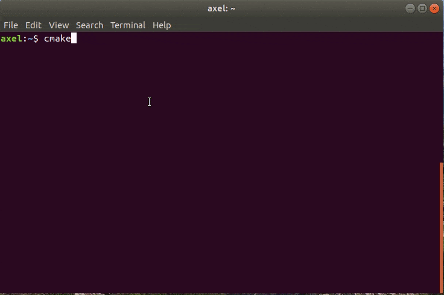

# cmake-easyinstall

Install CMake projects as simple as you love it from pip:
```sh
cmake-easyinstall install git+https://github.com/org/rego.git
```



## Install

```sh
curl -L -o cmake-easyinstall https://git.io/JvLxY
chmod a+x cmake-easyinstall
```

## Usage

```sh
cmake-easyinstall git-<https-url>.git [cmake-options]
```

## Dependencies

- bash
- cmake
- curl
- git
